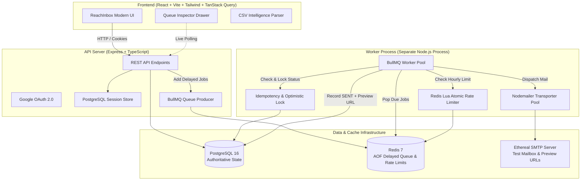
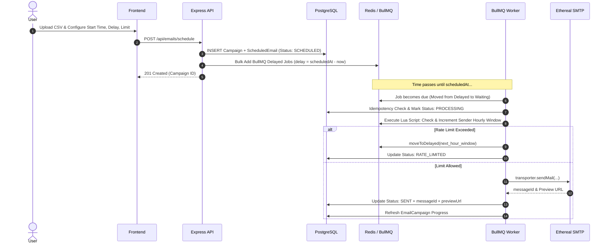

# ReachInbox Scheduler — Distributed Email Dispatch Engine

A production-grade, distributed email scheduling platform built for ReachInbox.ai / Outbox Labs. Engineered from the ground up with **BullMQ delayed jobs**, **Redis sliding window rate limiting**, **PostgreSQL authoritative state storage**, and **atomic idempotency guarantees**.

---

## 🌟 5 Core Differentiators

1. **CSV Intelligence & Automated Sanitization:**
   Client-side CSV & TXT parsing with automated email column detection, RFC validation, and duplicate removal tracking before queue submission.
2. **Dynamic Schedule Preview Calculator:**
   Real-time completion estimator factoring in both sequential inter-email delays ($N \times \text{delay}$) and hourly rate-limit windows ($\lceil N / \text{limit} \rceil \text{ hours}$).
3. **Live Queue Health & Rate Limit Utilization Widgets:**
   Real-time telemetry showing live BullMQ delayed/active/completed/failed job states and Redis sliding hourly quotas per sender.
4. **Idempotency & Restart Crash Persistence:**
   Deterministic `campaignId:recipient:sequenceNumber` keys with optimistic locking. Scheduled jobs survive backend/worker restarts without duplicate sends.
5. **Polished SaaS UI Inspired by ReachInbox Figma:**
   Refined white/slate theme with ReachInbox green accents, keyboard shortcuts (`C`, `G S`, `G T`, `?`), timeline pipeline visualization, and developer queue inspector.

---

## 🏗️ System Architecture



---

## 🔁 Scheduling & Dispatch Lifecycle



---

## 🔒 Idempotency Strategy & Distributed Boundary Analysis

### Idempotency Key Architecture
Each scheduled email is assigned a deterministic unique idempotency key:
$$\text{idempotencyKey} = \text{campaignId} + \text{":"} + \text{recipient} + \text{":"} + \text{sequenceNumber}$$

This key is enforced with a `UNIQUE` index constraint in PostgreSQL and used as BullMQ's `jobId`.

### Worker Processing Guardrails
1. **Status Pre-check:** Before invoking SMTP, the worker queries PostgreSQL. If the email status is already `SENT`, the job immediately acknowledges and terminates.
2. **Optimistic Database Locking:** The worker atomically transitions status from `SCHEDULED` $\rightarrow$ `PROCESSING` using an update query with status condition checks. If another worker already acquired the lock, the current worker skips execution.
3. **Post-Dispatch Persistence:** Upon receiving SMTP delivery confirmation, PostgreSQL is updated to `SENT` along with the Ethereal preview URL.

### ⚠️ Distributed Boundary Window (Honest Technical Trade-off)
In distributed systems without two-phase commit (2PC) or an external SMTP transaction coordinator, there exists an unavoidable millisecond window between:
1. *SMTP server successfully accepts the message payload*, and
2. *PostgreSQL writes the status change to `SENT`*.

If a hard server crash/SIGKILL occurs inside this exact window, the database will retain `PROCESSING`. Upon worker restart, the crash recovery mechanism safely identifies stale `PROCESSING` records and re-evaluates them. We deliberately term this **"Effectively-Once Delivery with Idempotency Safeguards"** rather than claiming impossible pure "exactly-once" delivery over uncoordinated network protocols.

---

## ⏱️ Redis Atomic Sliding Rate Limiting (Lua Script)

To prevent multiple concurrent worker processes from exceeding a sender's configured hourly limit (e.g. 50 emails/hour), rate limiting is executed directly inside Redis using an atomic Lua script:

```lua
local key = KEYS[1]
local limit = tonumber(ARGV[1])
local ttl = tonumber(ARGV[2])

local current = redis.call("INCR", key)

if current == 1 then
  redis.call("EXPIRE", key, ttl)
end

return current
```

- **Key Format:** `ratelimit:sender:{senderId}:hour:{YYYY-MM-DD-HH}`
- **Behavior on Limit Hit:** Rather than failing the email, the worker computes the millisecond offset to the next hourly window and calls `job.moveToDelayed(nextWindowTimestamp)`.
- **Ordering Preservation:** Rescheduled jobs retain their BullMQ metadata and resume in order as soon as the quota resets.

---

## 🔄 Server Crash & Restart Recovery

The application is engineered to guarantee zero job loss across complete infrastructure restarts:

1. **BullMQ / Redis Persistence:** Delayed jobs reside in Redis sorted sets. With Redis AOF (`appendonly yes`) enabled in `docker-compose.yml`, all pending timers persist to disk.
2. **Stateless API & Decoupled Workers:** The API server only enqueues jobs; it never executes SMTP calls. If the API server crashes or restarts, the worker continues dispatching seamlessly.
3. **Worker Reconnect:** When the worker restarts, BullMQ connects to Redis and immediately resumes processing due jobs. No jobs are re-created from scratch on startup.

---

## 📂 Project Structure

```
reachinbox-scheduler/
├── docker-compose.yml           # PostgreSQL 16 + Redis 7 services
├── sample_leads.csv             # Demo dataset with valid, invalid, duplicate leads
├── backend/
│   ├── prisma/
│   │   └── schema.prisma        # User, Session, Sender, EmailCampaign, ScheduledEmail
│   ├── src/
│   │   ├── config/              # env (Zod), redis (IORedis), logger (Pino), passport
│   │   ├── controllers/         # auth, email, campaign, sender, dashboard
│   │   ├── middleware/          # auth, validate (Zod), error handling
│   │   ├── queues/              # email.queue.ts (BullMQ definitions)
│   │   ├── repositories/        # database query abstractions
│   │   ├── routes/              # Express REST endpoints
│   │   ├── schemas/             # Zod input validation schemas
│   │   ├── services/            # email, mail (Nodemailer), rate-limit, dashboard
│   │   ├── workers/             # email.worker.ts (Separate worker process)
│   │   ├── scripts/             # setup-ethereal.ts
│   │   ├── __tests__/           # vitest suites (csv, rate-limit, schedule, idempotency)
│   │   ├── app.ts               # Express app factory
│   │   └── server.ts            # API server entrypoint
│   └── package.json
└── frontend/
    ├── src/
    │   ├── components/
    │   │   ├── ui/              # Button, Input, Table, Badge, Modal, StatCard, etc.
    │   │   ├── layout/          # Sidebar, Header
    │   │   ├── dashboard/       # QueueHealthCard, RateLimitCard, StatsOverview, RecentEmails
    │   │   ├── compose/         # CsvImportModal, EmailPreviewTab, SchedulePreviewCard
    │   │   ├── emails/          # EmailTimeline
    │   │   └── dev/             # DevTools (Queue & Redis Inspector Drawer)
    │   ├── hooks/               # useAuth, useKeyboardShortcuts
    │   ├── pages/               # LoginPage, DashboardPage, ComposePage, ScheduledPage, SentPage, SendersPage, CampaignsPage, SettingsPage
    │   ├── router/              # Protected & Public routing
    │   ├── services/            # Typed REST API client
    │   └── utils/               # csv, date, schedule, cn
    └── package.json
```

---

## 🚀 Quick Start Guide

### Prerequisites
- Docker & Docker Compose
- Node.js 20+ & npm

### 1. Start Infrastructure (PostgreSQL & Redis)
```bash
docker compose up -d
```

### 2. Configure Backend Environment
```bash
cd backend
cp .env.example .env
```
Generate an Ethereal test SMTP account automatically:
```bash
npm run setup:ethereal
```
Paste the output `ETHEREAL_USER` and `ETHEREAL_PASSWORD` into `backend/.env`.

### 3. Initialize Database Migrations
```bash
npm run db:push
```

### 4. Run Backend & Background Worker
Open two terminal tabs:
```bash
# Terminal 1: API Server
npm run dev

# Terminal 2: BullMQ Email Worker
npm run worker
```

### 5. Run Frontend
```bash
cd ../frontend
npm install
npm run dev
```
Open **`http://localhost:5173`** in your browser.

---

## 🧪 Automated Testing

Run the automated Vitest test suite:
```bash
cd backend
npm test
```
All unit and integration tests verify:
- Lead CSV header auto-detection, RFC validation, and duplicate removal
- Schedule completion time calculations across delay and hourly limit constraints
- Idempotency key uniqueness and safe optimistic state transitions

---

## ⏱️ 5-Minute Video Demonstration Script

| Timestamp | Screen / Flow | Key Feature Demonstrated |
|-----------|---------------|--------------------------|
| **0:00 – 0:45** | `/login` $\rightarrow$ `/dashboard` | Google OAuth 2.0 login, PostgreSQL session persistence, and overview of stats cards. |
| **0:45 – 1:45** | `/compose` | Select Sender, upload `sample_leads.csv` demonstrating CSV intelligence (17 valid, 3 invalid, 2 duplicates removed). |
| **1:45 – 2:30** | `/compose` | Write subject/body, toggle **Write / Preview** tab, set Start Time to now + 30s, Delay = 2s, Hourly Limit = 50. Highlight **Dynamic Schedule Preview** calculation. |
| **2:30 – 3:30** | `/scheduled` & DevTools | Click Schedule. Watch jobs enter BullMQ delayed queue. Open **Queue Inspector** drawer (`Terminal` icon or shortcut) to view live delayed job counts. |
| **3:30 – 4:15** | `/sent` | Worker processes due jobs. Watch live transition from Scheduled $\rightarrow$ Sent. Click **Open Mail** to inspect the live Ethereal test preview URL. |
| **4:15 – 5:00** | Server Restart Test | Schedule a future campaign. Stop the worker process (`Ctrl+C`). Wait 10 seconds. Restart worker (`npm run worker`). Prove that Redis retains delayed jobs and delivers without loss. |

---

## ⌨️ Keyboard Shortcuts

| Shortcut | Description |
|----------|-------------|
| <kbd>C</kbd> | Compose new email campaign |
| <kbd>G</kbd> then <kbd>S</kbd> | Navigate to Scheduled Emails |
| <kbd>G</kbd> then <kbd>T</kbd> | Navigate to Sent Emails |
| <kbd>G</kbd> then <kbd>D</kbd> | Navigate to Dashboard |
| <kbd>?</kbd> | Open Keyboard Shortcuts Modal |
| <kbd>Esc</kbd> | Close any open modal or drawer |

---

## 🛡️ Production Quality Attributes

- **TypeScript Strict Mode:** Comprehensive typing across models, API contracts, Zod schemas, and UI state.
- **Pino Structured Logging:** Redaction of sensitive fields (`password`, `smtpPass`, `secret`, `GOOGLE_CLIENT_SECRET`).
- **Separation of Concerns:** Zero SMTP dispatches inside HTTP API route handlers. All dispatch work delegated to isolated BullMQ workers.
- **Responsive Layout:** Adaptive desktop and mobile layouts with clean collapsible elements and responsive tables.
