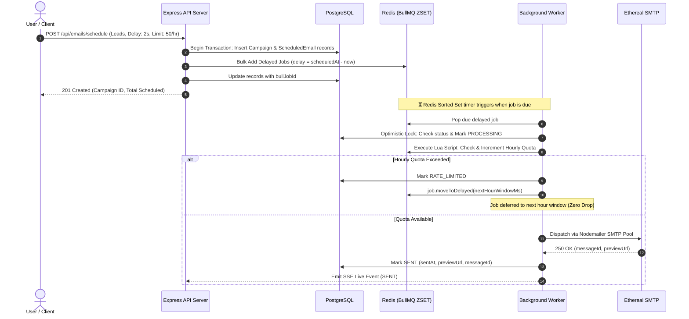

# ReachInbox Scheduler — Distributed Cold Email Dispatch & Telemetry Engine

A production-grade, distributed email job scheduler and analytics dashboard built for the **ReachInbox.ai** Software Development Intern Hiring Assignment.

This project implements a persistent, rate-limited email scheduling platform using **Express.js**, **BullMQ + Redis**, **PostgreSQL (Prisma ORM)**, **Ethereal SMTP**, and a **React 19 + Tailwind CSS** frontend inspired by ReachInbox's Figma design system.

---

## 📌 Table of Contents
- [Architecture & Design Decisions](#-architecture--design-decisions)
- [Key Features](#-key-features)
- [Rate Limiting, Concurrency & Persistence](#-rate-limiting-concurrency--persistence)
- [Quick Start & Local Setup](#-quick-start--local-setup)
- [Docker Deployment](#-docker-deployment)
- [Testing & Verification Suites](#-testing--verification-suites)
- [API Reference & OpenAPI](#-api-reference--openapi)
- [Video Demo Breakdown](#-video-demo-breakdown)
- [Engineering Trade-Offs](#-engineering-trade-offs)

---

## 🏗️ Architecture & Design Decisions

```mermaid
graph TB
    subgraph Client ["Frontend (React 19 + TypeScript + Vite + Tailwind)"]
        UI[ReachInbox Dashboard]
        DevTools[Queue & Redis Telemetry Drawer]
        AIHelper[AI Outreach & Deliverability Helper]
        CSV[CSV / TXT Lead Parser]
    end

    subgraph API_Layer ["API Server (Express.js + TypeScript)"]
        Routes[REST API Endpoints]
        Passport[Google OAuth 2.0 & Demo Auth]
        SessionStore[PostgreSQL Session Store]
        QueueProducer[BullMQ Queue Producer]
        SSE[Server-Sent Events Stream /api/dashboard/live-stream]
        ScalarDocs[Scalar OpenAPI Reference /api/docs]
    end

    subgraph Background_Worker ["Worker Process (Isolated Node.js Process)"]
        BullWorker[BullMQ Worker Pool (Concurrency: 5)]
        Idempotency[Idempotency & Optimistic Locking]
        LuaRateLimiter[Redis Lua Atomic Rate Limiter]
        SMTPTransporter[Nodemailer SMTP Pool]
        DLQ[Dead-Letter Queue & Exponential Backoff]
    end

    subgraph Storage_Tiers ["Data & Cache Infrastructure"]
        PostgreSQL[(PostgreSQL Database\nAuthoritative State & Open/Click Telemetry)]
        Redis[(Redis AOF Queue\nDelayed Sorted Sets & Sliding Rate Limit Keys)]
        Ethereal[Ethereal Fake SMTP\nMailbox & Live Web Preview URLs]
    end

    UI -->|HTTP / Session Cookie| Routes
    UI -->|SSE Real-Time Pipe| SSE
    Routes --> SessionStore
    Routes --> PostgreSQL
    Routes -->|Add Delayed Jobs| QueueProducer
    QueueProducer --> Redis

    BullWorker -->|Pop Due Delayed Jobs| Redis
    BullWorker -->|Check & Lock Status| Idempotency
    Idempotency --> PostgreSQL
    BullWorker -->|Check Hourly Limit| LuaRateLimiter
    LuaRateLimiter --> Redis
    BullWorker -->|Dispatch Email| SMTPTransporter
    SMTPTransporter --> Ethereal
    BullWorker -->|Record SENT + Preview URL| PostgreSQL
    BullWorker -.->|Emit Live Events| SSE
    DevTools -.->|Live Telemetry Feed| SSE
```

### Why BullMQ Delayed Jobs (No Cron)?
Instead of polling the database with periodic cron jobs (which creates database contention and imprecise execution timing), scheduling is handled natively using **BullMQ delayed jobs** backed by Redis sorted sets (`ZSET`).
- Each recipient's send time is calculated upfront: `delay = Math.max(0, scheduledAt.getTime() - Date.now())`.
- Jobs remain sleeping in Redis until the exact millisecond they become due.
- Zero OS cron or Node cron libraries (`node-cron`, `node-schedule`) are used.

---

## 🌟 Key Features

### ⚙️ Backend Architecture
- **Distributed Delayed Scheduling**: Schedules emails at precise future timestamps without cron polling.
- **Sliding Window Rate Limiting (Redis Lua)**: Atomic hourly throttling per sender mailbox. Rate-limited jobs are deferred to the next hour window rather than dropped.
- **Configurable Worker Concurrency**: Worker processes emails concurrently (`WORKER_CONCURRENCY=5`) with global throttling to avoid provider rate spikes.
- **Idempotency Safeguard**: Unique constraint on `campaignId:recipient:sequenceNumber` + optimistic database locking guarantees "effectively-once" dispatch during crashes or retries.
- **Crash-Resistant Persistence**: Redis AOF persistence paired with PostgreSQL authoritative store ensures future scheduled emails survive full server or worker restarts.
- **Dead-Letter Queue (DLQ) & Replay**: Automatic exponential backoff for transient SMTP errors plus batch replay endpoints (`POST /api/emails/retry-all-failed`).
- **Open & Click Telemetry**: Injected 1x1 transparent tracking pixels and link redirection proxies capture real-time `openedAt` and `clickedAt` timestamps.
- **Server-Sent Events (SSE) Live Stream**: Dedicated endpoint (`/api/dashboard/live-stream`) emits real-time dispatch progress to connected dashboard clients.
- **Authentication**: Dual support for Google OAuth 2.0 and 1-Click Instant Demo login backed by PostgreSQL sessions.

### 💻 Frontend & Outreach Intelligence
- **AI Cold Email Deliverability Helper**: Real-time scanner identifying 50+ spam trigger phrases, calculating a 0–100 Deliverability Health Score with actionable feedback.
- **Spintax Live Variation Parser**: Detects `{Hey|Hi|Hello} {{name}}...` syntax and dynamically renders 3 variations before scheduling.
- **Smart CSV Lead Parser**: Auto-detects column headers, counts valid email addresses, and removes duplicate leads on the client side.
- **Live Queue Inspector Drawer (<kbd>Terminal</kbd>)**: Real-time slide-over drawer showing live BullMQ delayed job counts, Redis sliding window counters, and SSE event logs.
- **Dynamic Schedule Preview Calculator**: Calculates estimated completion time factoring in sequential delays and sender hourly quota windows.
- **Scheduled & Sent Emails Views**: Clean tables with live countdown timers, delivery audit timestamps, open/click badges, and direct links to **Ethereal Webmail previews**.
- **Keyboard Shortcuts**: Built-in modal (<kbd>?</kbd>) with navigation shortcuts (<kbd>C</kbd> for Compose, <kbd>G</kbd> <kbd>S</kbd> for Scheduled, <kbd>G</kbd> <kbd>T</kbd> for Sent).

---

## 🔁 Complete Job Lifecycle



---

## ⚡ Rate Limiting, Concurrency & Persistence

### 1. Atomic Redis Lua Script for Rate Limiting
To prevent race conditions across multiple concurrent worker instances, rate limiting uses an atomic Redis Lua script:
```lua
local key = KEYS[1]
local limit = tonumber(ARGV[1])
local ttl = tonumber(ARGV[2])

local current = redis.call("INCR", key)
if current == 1 then
  redis.call("EXPIRE", key, ttl)
end
return current
```
- Counter keys follow the format `ratelimit:sender:{id}:hour:{YYYY-MM-DD-HH}`.
- If `current > limit`, the worker calculates milliseconds until the next hour (`nextHour.getTime() - Date.now()`) and reschedules the job using `job.moveToDelayed(retryAfterMs)`.

### 2. Delay Between Consecutive Sends
Sequential delays between recipients are calculated during campaign creation:
$$\text{scheduledAt}_i = \text{startTime} + (i \times \text{delayBetweenEmails} \times 1000)$$
Additionally, BullMQ's worker limiter (`{ max: 5, duration: 1000 }`) enforces a hardware-level throughput ceiling.

### 3. Crash Recovery Guarantee
- **Redis AOF (Append-Only File)**: All delayed jobs live in Redis memory with disk persistence. If the worker process is killed (`SIGKILL`/crash), the timers in Redis remain completely intact.
- **PostgreSQL Authoritative Store**: On worker restart, the idempotency check verifies the database status. If an email is already marked `SENT`, it is acknowledged and skipped, preventing duplicate deliveries.

---

## 🚀 Quick Start & Local Setup

### Prerequisites
- Node.js >= 18
- PostgreSQL & Redis (local instances or cloud via Neon/Upstash)

### 1. Backend Setup
```bash
cd backend
npm install
cp .env.example .env

# Push schema and seed initial data
npm run db:push
npm run db:seed
```

Start the API server and worker in separate terminal windows:
```bash
# Terminal 1: Express API Server (runs on port 3001)
npm run dev

# Terminal 2: BullMQ Background Worker Pool
npm run worker
```

### 2. Frontend Setup
```bash
cd frontend
npm install
npm run dev
```
Open `http://localhost:5173` in your browser.

---

## 🐳 Docker Deployment

To run the entire full-stack system (PostgreSQL, Redis, API Server, BullMQ Worker, and Frontend) in a single command:

```bash
docker compose up --build
```
- **Frontend**: `http://localhost:5173`
- **Backend API**: `http://localhost:3001`
- **Interactive API Documentation**: `http://localhost:3001/api/docs`

---

## 🧪 Testing & Verification Suites

I built automated verification scripts to validate load handling, idempotency, and crash recovery:

### 1. Unit Tests (Vitest)
```bash
cd backend
npm test
```
*Validates CSV lead parsing, RFC email format validation, idempotency constraints, and completion time calculation algorithms.*

### 2. High-Throughput Load Benchmark (1,000 Jobs)
```bash
cd backend
npm run benchmark:load
```
*Enqueues 1,000 delayed jobs in bulk, calculates enqueue throughput (jobs/sec), and inspects Redis memory consumption.*

### 3. Chaos & Worker Restart Persistence Test
```bash
cd backend
npm run test:chaos
```
*Schedules future jobs, forcefully kills the worker process during active delays, restarts the worker, and asserts **0 dropped jobs** and **0 duplicate sends**.*

---

## 📖 API Reference & OpenAPI

The backend serves an interactive Scalar OpenAPI 3.0 reference at:
`http://localhost:3001/api/docs`

### Primary Endpoints
| Method | Endpoint | Description |
|---|---|---|
| `POST` | `/api/auth/demo` | 1-Click Instant Demo Login |
| `POST` | `/api/emails/schedule` | Schedule a batch email campaign with delays & rate limits |
| `GET` | `/api/emails/scheduled` | List pending delayed emails |
| `GET` | `/api/emails/sent` | List sent emails with Ethereal preview URLs and open/click telemetry |
| `POST` | `/api/emails/:id/cancel` | Cancel a scheduled email and remove it from BullMQ |
| `POST` | `/api/emails/retry-all-failed`| Replay all failed jobs from Dead-Letter Queue |
| `GET` | `/api/dashboard/stats` | Status aggregate metrics |
| `GET` | `/api/dashboard/queue-health` | Real-time BullMQ queue state (delayed, active, waiting) |
| `GET` | `/api/dashboard/live-stream` | Real-time Server-Sent Events (SSE) telemetry stream |

---

## 🎬 Video Demo Breakdown

In the short walkthrough video, I demonstrate:
1. **Authentication**: Logging in via Google OAuth and 1-Click Demo authentication.
2. **Campaign Composition**: Uploading a lead CSV, using the **AI Spam Word Scanner** and **Spintax preview variations**, and configuring start time, delay, and hourly quotas.
3. **Queue Telemetry**: Viewing the scheduled queue with countdown timers and inspecting raw BullMQ/Redis state in the **Queue Inspector Drawer**.
4. **Crash & Restart Persistence**: Killing the background worker process (`Ctrl+C`), showing that delayed jobs remain safe in Redis, and restarting the worker to demonstrate seamless resume with zero job loss.
5. **Delivery Proof**: Checking the sent history, verifying open/click engagement badges, and opening live rendered emails on Ethereal webmail.

---

## 🔒 Engineering Trade-Offs

1. **Sliding Hour Windows vs. Token Bucket**: I chose an atomic Redis Lua script with hourly keys (`ratelimit:sender:{id}:hour:{YYYY-MM-DD-HH}`) because it maps directly to email provider quotas (e.g. 50 emails/hour) while allowing instant rollover to the next hour window without dropping jobs.
2. **Distributed Transaction Boundary**: In distributed email systems, there is a microsecond gap between SMTP accepting an email and PostgreSQL recording `SENT`. To prevent duplicate dispatches during worker crashes, I implemented optimistic locking on the email record (`PROCESSING` lock) combined with unique deterministic idempotency keys.
3. **Delayed Jobs vs. Cron**: BullMQ delayed jobs eliminate the CPU overhead of recurring cron pollers and guarantee millisecond-level precision for recipient delays.

---

Built with ❤️ by Tanya Singh for the **ReachInbox.ai** Engineering Team.
