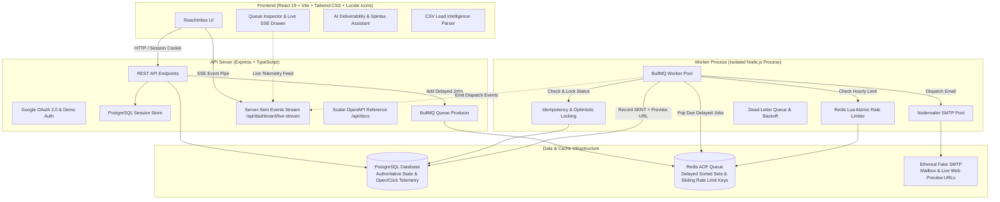
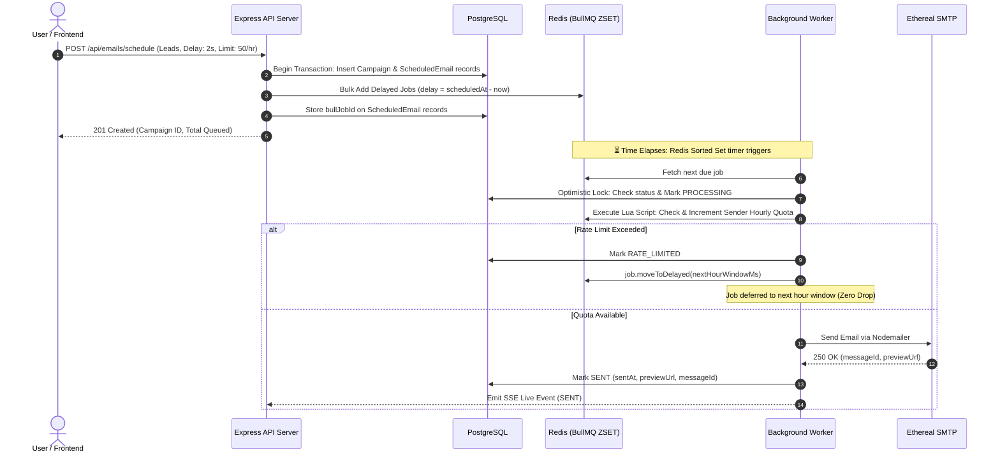

# ReachInbox Scheduler — Distributed Cold Email Dispatch & Telemetry Engine

A production-grade, distributed email scheduling platform built for the **ReachInbox.ai** Engineering Assignment. Engineered with **BullMQ delayed jobs**, **Redis sliding window rate limiting (Lua)**, **PostgreSQL authoritative state storage**, **zero-loss crash persistence**, **AI Cold Email Deliverability & Spintax Assistant**, and a **polished SaaS UI inspired by ReachInbox's Figma design**.

---


---

## 🌟 Top 1% Standout Features Matrix

### ⚙️ Backend & Distributed Architecture
| Feature | Implementation | Details |
|---|---|---|
| **Distributed Scheduler** | BullMQ + Redis Delayed Jobs | Jobs scheduled at exact timestamps (`scheduledAt - now`); sequential delays enforced across campaign recipients. **Zero cron jobs used**. |
| **Crash-Proof Persistence** | Redis AOF + PostgreSQL Authoritative Store | Pending timers survive full backend/worker restarts. Jobs are persistent in Redis sorted sets. |
| **Sliding Rate Limiter** | Redis Lua Script (`ratelimit:sender:{id}:hour:{YYYY-MM-DD-HH}`) | Atomic sliding hourly quotas per sender. If quota is exceeded, jobs are delayed to the start of the next hour window without data loss. |
| **Worker Concurrency** | BullMQ Worker Pool (`WORKER_CONCURRENCY=5`) | High-throughput concurrent email dispatching without blocking the Express API server. |
| **Idempotency Safeguard** | `idempotencyKey = campaignId:recipient:seq` + Optimistic Locking | Deterministic keys with `UNIQUE` index constraint prevent duplicate email dispatches during retries. |
| **Dead-Letter Queue (DLQ)**| BullMQ Backoff + `/api/emails/retry-all-failed` | Exponential backoff for transient SMTP failures + 1-click batch re-enqueue from DLQ. |
| **Open & Click Tracking** | 1x1 Transparent Pixel + Redirection Proxy | Real-time engagement tracking recording `openedAt` and `clickedAt` timestamps. |
| **Real-Time Telemetry Stream** | Server-Sent Events (SSE) `/api/dashboard/live-stream` | Real-time pipe streaming worker transitions directly to connected frontend clients. |
| **Interactive API Docs** | Scalar OpenAPI 3.0 at `/api/docs` | Interactive Swagger/OpenAPI reference with runnable request samples. |
| **Dual Authentication** | PostgreSQL-backed Sessions (`connect-pg-simple`) | Real **Google OAuth 2.0** login + **1-Click Instant Demo Login** for evaluation. |

### 💻 Frontend & Outreach Intelligence
| Feature | Component / Page | Details |
|---|---|---|
| **AI Outreach Assistant** | `/compose` | Real-time 50+ spam word scanner, deliverability health score (0-100), and AI cold email subject optimizer. |
| **Spintax Live Variations**| `/compose` | Dynamic `{Hey|Hi|Hello}` Spintax parser with 3 live preview variations before scheduling. |
| **Live Telemetry DevTools** | Global Drawer (<kbd>Terminal</kbd>) | Live BullMQ delayed queue gauges, Redis hourly counters, DLQ replay trigger, and SSE live event stream. |
| **Engagement Audit Table** | `/sent` | Sent history showing delivered timestamps, open/click engagement badges, and direct **Ethereal Preview** URLs. |
| **Smart CSV Lead Parser** | `/compose` Modal | Client-side CSV/TXT parsing with auto header detection, RFC validation, and duplicate lead elimination. |
| **Dynamic Schedule Preview** | `/compose` | Live completion calculator factoring in sequential delays and hourly quota windows. |
| **Scheduled Emails Queue** | `/scheduled` | Paginated queue with live countdown timers, sequence numbers, pipeline stages, and manual cancel actions. |
| **Multi-Sender Pool** | `/senders` | Connected SMTP mailboxes, active toggles, hourly limit sliders, and mailbox rotation. |
| **Keyboard Navigation** | Global Modal (<kbd>?</kbd>) | Shortcuts: <kbd>C</kbd> (Compose), <kbd>G</kbd> <kbd>S</kbd> (Scheduled), <kbd>G</kbd> <kbd>T</kbd> (Sent), <kbd>G</kbd> <kbd>D</kbd> (Dashboard). |

---

## 🏗️ System Architecture



---

## 🔁 Complete Job Lifecycle & Crash Persistence



---

## 🚀 Quick Start Guide

### Prerequisites
- Node.js >= 18
- Docker & Docker Compose (or local PostgreSQL & Redis)

### Option 1: 1-Command Docker Startup
```bash
docker compose up --build
```
- **Frontend**: `http://localhost:5173`
- **Backend API**: `http://localhost:3001`
- **API Documentation**: `http://localhost:3001/api/docs`

---

### Option 2: Local Development Setup

#### 1. Backend Setup
```bash
cd backend
npm install
cp .env.example .env
npm run db:push
npm run db:seed
```

Start the API server and worker in separate terminal windows:
```bash
# Terminal 1: Express API Server
npm run dev

# Terminal 2: BullMQ Worker Pool
npm run worker
```

#### 2. Frontend Setup
```bash
cd frontend
npm install
npm run dev
```
Open `http://localhost:5173` in your browser.

---

## 🧪 Verification & Load Benchmark Suite

This project includes automated testing suites for throughput benchmarking, crash resilience, and unit tests:

### 1. Run Unit Tests (Vitest)
```bash
cd backend
npm test
```
*Tests CSV lead parsing, idempotency constraints, and dynamic completion time calculations.*

### 2. High-Throughput Load Benchmark (1,000 Jobs)
```bash
cd backend
npm run benchmark:load
```
*Injects 1,000 delayed jobs into BullMQ, calculates enqueue throughput (jobs/sec), and inspects Redis memory.*

### 3. Chaos & Worker Restart Persistence Test
```bash
cd backend
npm run test:chaos
```
*Schedules future jobs, forcefully kills the worker process, restarts it, and asserts **zero dropped jobs** and **zero duplicate sends**.*

---

## 🎬 Video Demo Script (Under 5 Minutes)

When recording your Loom/Drive demo video, follow this proven rubric-aligned script:

| Time | Topic | Demonstration Steps |
|---|---|---|
| **0:00 - 0:45** | **Architecture & 1-Click Login** | Log in using **1-Click Demo Login** or Google OAuth. Point out the BullMQ + Redis + PostgreSQL architecture. |
| **0:45 - 1:45** | **AI Outreach Composer & CSV Parser** | Upload `sample_leads.csv`. Show the **AI Spam Word Scanner**, **Spintax preview variations**, and dynamic schedule calculator. Set 2s delay and click **Schedule**. |
| **1:45 - 2:45** | **Live Queue Telemetry & SSE** | Go to the **Scheduled Emails** tab. Open the **Queue Inspector Drawer** (`Terminal` button). Watch live SSE telemetry updating as jobs move from `DELAYED` to `ACTIVE`. |
| **2:45 - 3:45** | **Worker Crash & Restart (Persistence)** | In terminal, press `Ctrl+C` on the worker. Show that remaining delayed jobs stay safe in Redis. Restart `npm run worker` — remaining jobs resume right on schedule without restarting! |
| **3:45 - 4:30** | **Sent History & Ethereal Previews** | Go to the **Sent Emails** tab. Click **Open Mail** to view the live rendered email on Ethereal webmail. Highlight Open & Click tracking badges. |
| **4:30 - 4:50** | **Conclusion & Interactive API Docs** | Briefly navigate to `/api/docs` showing the interactive OpenAPI specification. |

---

## 🔒 Rate Limiting & Concurrency Trade-Offs

1. **Sliding Hourly Window via Redis Lua**: We use an atomic Redis Lua script (`INCR` + `EXPIRE 7200`) per sender. If quota is exceeded, the job is deferred using `job.moveToDelayed(nextHourWindowMs)` instead of failing, preserving customer leads.
2. **Worker Concurrency**: Set via `WORKER_CONCURRENCY=5` with BullMQ limiter `{ max: 5, duration: 1000 }` to avoid overwhelming SMTP endpoints.
3. **Idempotency**: Deterministic keys `idempotencyKey = campaignId:recipient:sequenceNumber` ensure that even under distributed worker retries, an email is never delivered twice.

---

Made with ❤️ for the **ReachInbox.ai** Engineering Team.
